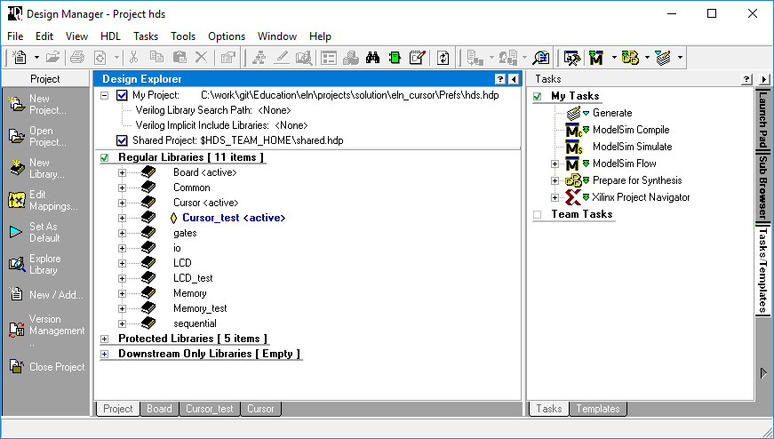

<h1 align="center">
  <br>
  
  <br>
  DiD Project Cursor
  <br>
</h1>

<h4 align="center">Labor Files for DiD Semester Project Cursor.</h4>

# Table of contents
<p align="center">
  <a href="#description">Description</a> •
  <a href="#how-to-use">How To Use</a> •
  <a href="#credits">Credits</a> •
  <a href="#license">License</a> •
  <a href="#fund-us-on">Find us on</a>
</p>



## Description
[(Back to top)](#table-of-contents)

Laboratory file for semesterproject chronometer for first year bachelor students.

## How To Use
[(Back to top)](#table-of-contents)

To clone and run this application, you'll need [Git](https://git-scm.com) and [HDL Designer](https://www.mentor.com/products/fpga/hdl_design/hdl_designer_series/) as well as [Modelsim](https://www.mentor.com/products/fv/modelsim/) installed on your computer. From your command line:


### Launch
```bash
# Change to location for the Sourcecode on your PC for Example Base of Drive U:
U:

# Clone this repository
git clone https://github.com/hei-synd-did/did-cursor.git

# Go into the repository
cd did-cursor

# Run the app
## Linux
./did-cursor.bash

## Windows
.\did-cursor.bat
```

### Update Student **Fork** to the latest modification from **Master** Repo

```bash
# goto your student fork repo location
cd u:\did-chrono\

# add upstream Master remote
git remote add upstream https://github.com/hei-synd-did/did-cursor.git

# like "git pull" which is fetch + merge)
git fetch upstream
git merge upstream/master master

# Push the changes into your own fork repo
git push origin master
```

## Credits
[(Back to top)](#table-of-contents)
* CoF
* BiC
* PrC
* ZaS
* AmA

## License
[(Back to top)](#table-of-contents)

:copyright: [All rights reserved](LICENSE)

---

## Find us on
[hevs.ch](https://www.hevs.ch) &nbsp;&middot;&nbsp;
Facebook [@hessovalais](https://www.facebook.com/hessovalais) &nbsp;&middot;&nbsp;
Twitter [@hessovalais](https://twitter.com/hessovalais) &nbsp;&middot;&nbsp;
LinkedIn [HES-SO Valais-Wallis](https://www.linkedin.com/groups/104343/) &nbsp;&middot;&nbsp;
Youtube [HES-SO Valais-Wallis](https://www.youtube.com/user/HESSOVS)
